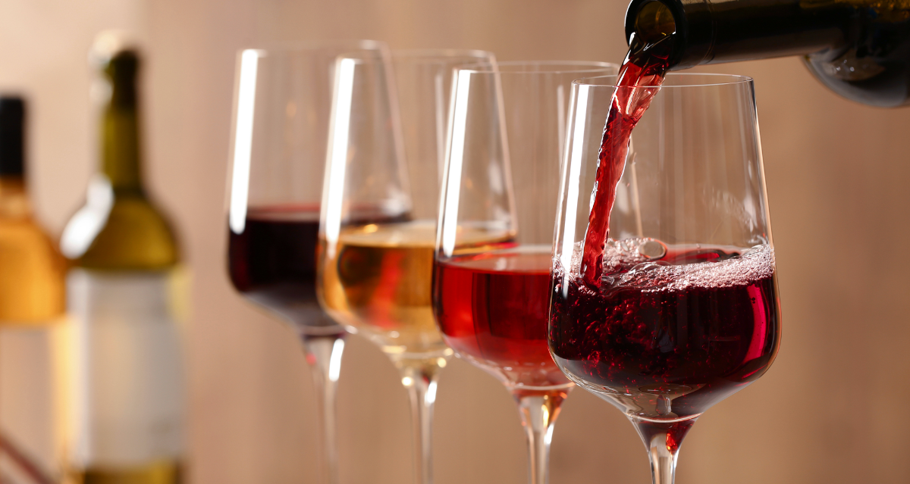
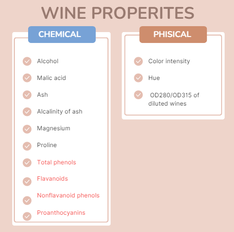
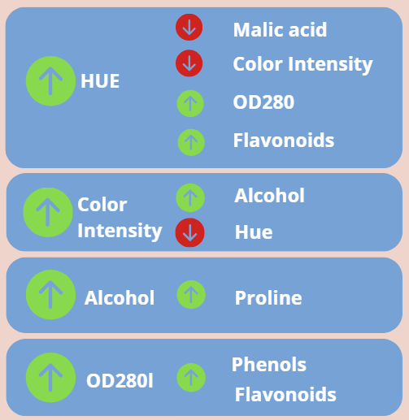
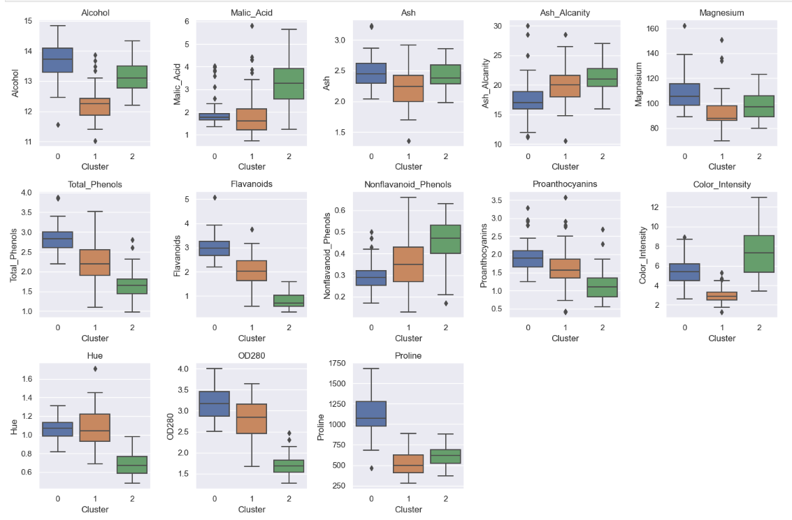

# Uncovering the Hidden Profiles in Wine Data

## 1. Objective
This project is focused on examining wines by conducting a detailed analysis of their features.

The dataset consists of the results of a chemical analysis of wines grown in the same region of Italy but derived from three different cultivars. The analysis determined the quantities of 13 components present in each of the three types of wines.

Patterns in the data will be sought to reveal valuable information and gain a deeper understanding of how their properties are related. The wine categories that can be used for classification will also be identified through the development of a clustering model.

<!-- Imagen redimensionada centrada con estilos en línea -->

  

## 2. Data Exploration

:point_right: [Notebook](Notebooks/wines_EDA.ipynb)

The dataset had good quality. It did not contain missing data, so there was no need to perform imputations or transformations. It also did not exhibit erroneous or atypical values. A correlation analysis between variables was conducted. Due to the nature of the data, the Spearman correlation coefficient was chosen, which does not assume linearity between variables or that the features follow a normal distribution. P-values were also calculated to determine statistically significant correlations.

The following results were obtained:

> ####  The content of Alcohol and Proline are positively correlated. As the alcohol content in a wine increases, the Proline content also increases.
> #### The hue is negatively correlated with malic acid and positively correlated with flavanoids. Wines with lower values of malic acid and higher values of flavanoids exhibit higher hues.
> #### Total_phenols is strongly correlated with Flavonoids and Proanthocyanins, which is expected since Flavonoids and Proanthocyanins are included in the total_phenols category.
> #### The color intensity is positively correlated with the alcohol content of the wine. There is also a negative correlation between the color intensity of the wine and its hue. Wines with more intense colors have lower hue.
> #### The OD280 is strongly correlated with flavanoid phenolic compounds. Also Wines with higher hues have a higher OD280 coefficient.

<!-- Imagen redimensionada centrada con estilos en línea -->

  

## 3. Clustering Analysis

:point_right: [Notebook](Notebooks/wines_EDA.ipynb)

With the aim of grouping wines with similar characteristics, unsupervised clustering models were implemented. First K-means algorithm was implemented, which requires the prior definition of the number of groups.

To define it, the elbow rule was applied, identifying the inflection point on the inertia curve (sum of squared distances to the centroids) versus the number of clusters (k). It was determined that 3 clusters were optimal. This value was validated using Silhouette and Calinski-Harabasz metrics. As a result of this model, wines could be divided into three families, each with different properties.

In a second instance, the hierarchical clustering algorithm was used, which does not require defining the number of clusters in advance.

A comparison between the two models was conducted, and it was observed that both cluster the wines practically the same way.

### 3.1 Properties of each Cluster

In the boxplots, it can be observed how the properties of the wines vary from one cluster to another.

It is noticeable that the properties in which the clusters differ mainly are:

Alcohol
Total Phenols
Flavanoids
Color intensity

### First Category (cluster 0):

- High alcohol content
- High levels of Phenols,Flavanoids
- Moderate color intensity
- High Proline content
- High OD280
  
### Second Category (cluster 1):

- Low alcohol content
- Moderate levels of Phenols,Flavanoids
- Low color intensity
- Low Proline content
- Moderate OD280

### Third Category (cluster 2):

- Intermediate alcohol content
- High Maleic Acid content
- Low Phenols,Flavanoids content
- Low hue
- Low OD280
- High color intensity

### 3.2. Correlations after Clustering
The relationship between color intensity and the other studied characteristics was examined, both for the entire dataset and for each of the determined clusters.  
In the overall dataset, it is observed that color intensity is primarily correlated with the alcohol content in the wine. The correlation coefficient did not show a high value for the total amount of phenols and flavonoids. However, when we repeat this analysis while discriminating by cluster, it is observed that wines corresponding to cluster 0 exhibit the highest correlation with phenol content, particularly with flavonoids. Analyzing the records of cluster 1, although they do not show such a strong correlation, a scatter plot revealed they followed the trend of cluster 0. In the case of cluster 2, the strong correlation with color intensity occurs with the content of Proanthocyanidins and not with the content of flavonoids.

## 4. Conclusions
1. Data Exploration: The dataset demonstrated good quality, lacking missing or erroneous values. Correlation analysis highlighted key relationships, such as the positive correlation between alcohol and Proline, and the negative correlation between hue and malic acid.

2. Clustering Analysis: Unsupervised clustering using K-means revealed three distinct clusters, confirmed by hierarchical clustering. Each cluster exhibited unique properties, notably varying in alcohol, phenols, flavonoids, and color intensity.

3. Insights
Exploring color intensity revealed its primary correlation with alcohol in the overall dataset. However, cluster analysis uncovered unique patterns, with Cluster 0 showing a strong correlation with phenols (especially flavanoids), Cluster 1 following a similar trend, and Cluster 2 correlating strongly with Proanthocyanins.

In summary, this project successfully unveiled hidden profiles within wine data, offering valuable insights into the dataset's relationships and patterns.

## 5 Containerization and Data Retrieval:

### Containerization
A Dockerfile and necessary configurations to build a Docker image were developed.  
:point_right: [readme containerization](DockerImage/README.md)

The analysis includes:
:white_check_mark: Number of rows and columns in the dataset 
:white_check_mark: Number of null values 
:white_check_mark: Columns correlated with a correlation coefficient higher than 0.5 
:white_check_mark: K-Means Clustering : Features mean values for each cluster 

### Data Retrieval
:point_right: [main.py fastAPI](main.py) 
A simple REST API was developed and deployed with Render. Through this API, the script inside the container can access data via a request.
ENDPOINT = "https://wine-data.onrender.com/wine"

### Technologies and Tools

)

